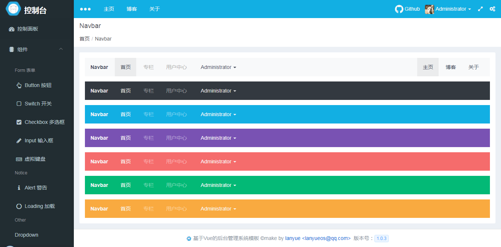
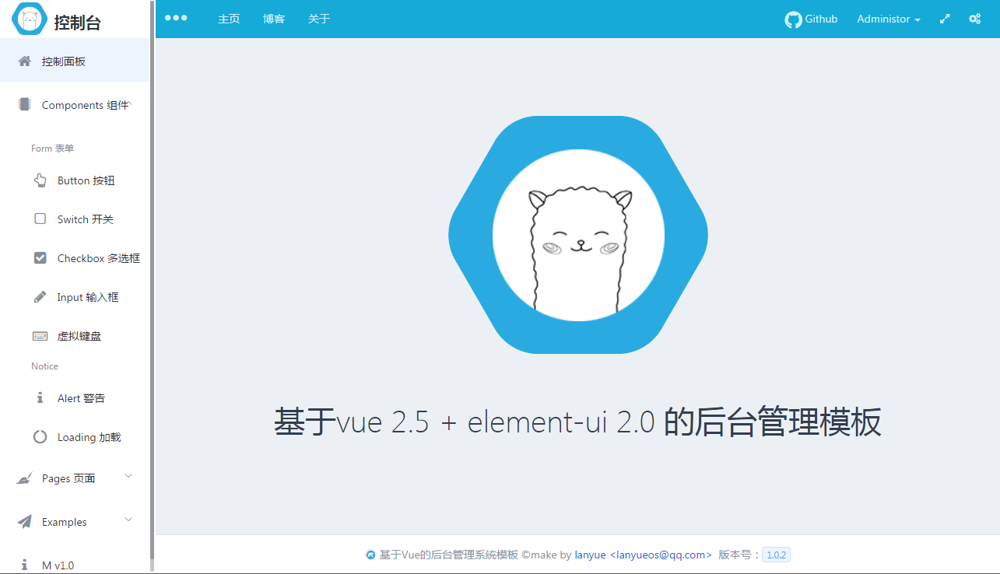
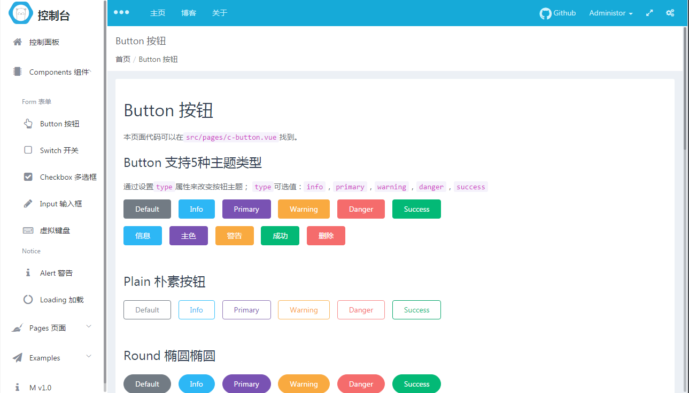
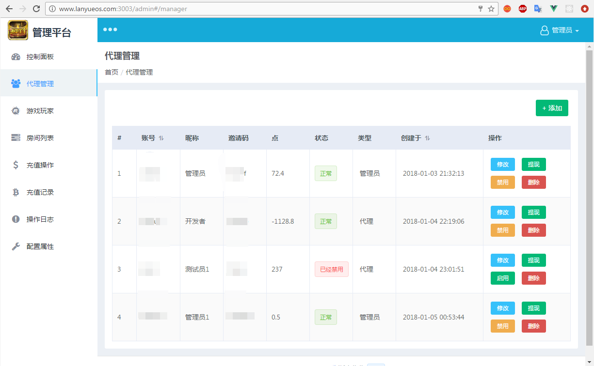

# vue-element-admin-tpl

基于vue + element-ui开发的后端管理系统模板。

+ vue
+ vue-router
+ axios
+ element-ui
+ nprogress
+ 使用了 `FontAwesome 4.7.0` 的图标


> `src/m` 目录下收藏了些本人工作时开发的一些组件，欢迎使用与提建议；使用方法请看对应的README.md说明文档。

> 注：布局采用了 `display:flex` 实现，在IE上可能会出现一些不愉快的事情。


## 实现组件

+ [按钮组件](src/m/button)
+ [多选框](src/m/checkbox)
+ [switch](src/m/switch)
+ [输入框](src/m/input)
+ [导航](src/m/navbar)
+ [dropdown](src/m/dropdown)
+ [响应式布局](src/m/container)
+ [加载等待](src/m/loading)
+ [提示](src/m/alert)
+ [回到到顶部](src/m/back-top)
+ [盒子](src/m/box)
+ [列表组](src/m/list-group)
+ [虚拟键盘（中/英）](src/m/keyboard)
+ [虚拟数字键盘](src/m/number-keyboard)


## 页面

+ [登录](http://vadmin.lanyueos.com/login)
+ [注册](http://vadmin.lanyueos.com/register)
+ [404](http://vadmin.lanyueos.com/404)
+ [500](http://vadmin.lanyueos.com/500)

+ [cnode](http://vadmin.lanyueos.com/cnode)


## 截图








## 关于打包


对于打包，如果你使用git管理，推荐使用 `npm run publish` 命令进行打包，这样的的话打包前会执行更新 `package.json` 中的version字段；
打包时会挂载 `APP_INFO` 对象到 `window` 对象上，在vue组件中可以直接 `window.APP_INFO` 访问版本信息。

**window.APP_INFO**

```js
// window.APP_INFO对象大致内容

{
  projectName: pkg.name,
  version: pkg.version,
  description: pkg.description,
  author: pkg.author,
  appName: pkg.app && pkg.app.name || pkg.appName,
  dependencies: pkg.dependencies,
  engines: pkg.engines,
  license: pkg.license,

  // 如果是npm run publish打包会存在下面两个字段
  // 打包时间
  date: '',
  // 本次打包MD5
  md5: ''
}

```
> 为什这么做？
> 方便知道谁，什么时候打的包


## 案例

1、[**浙中牛牛**（预览版）](http://www.lanyueos.com:3003) 账号：admin 密码：123456 （请不要乱改数据）




## Build Setup

``` bash
# install dependencies
npm install

# serve with hot reload at localhost:8080
npm run dev

# build for production with minification
npm run build

# build for production and view the bundle analyzer report
npm run build --report

# run unit tests
npm run unit

# run e2e tests
npm run e2e

# run all tests
npm test
```

For a detailed explanation on how things work, check out the [guide](http://vuejs-templates.github.io/webpack/) and [docs for vue-loader](http://vuejs.github.io/vue-loader).
