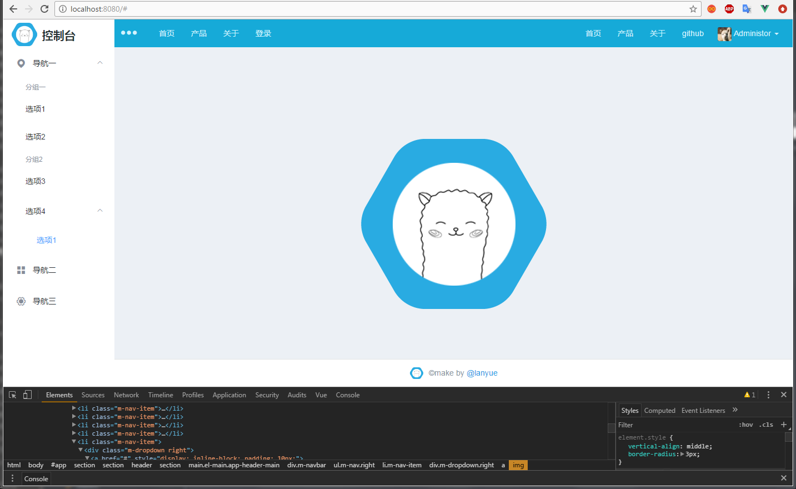

# vue-element-admin-tpl

> A Vue.js project


## 插件

+ element-ui
+ axios
+ vuex


## 组件

+ navbar 响应式导航
+ dropdown 下拉列表


#### navbar

响应式导航，类似bootstrap的风格

#### dropdown

下拉菜单，类似bootstrap风格

## 指令

+ v-cmenu 模拟右键菜单

#### v-cmenu

虚拟的右键菜单


## 截图



## Build Setup

``` bash
# install dependencies
npm install

# serve with hot reload at localhost:8080
npm run dev

# build for production with minification
npm run build

# build for production and view the bundle analyzer report
npm run build --report

# run unit tests
npm run unit

# run e2e tests
npm run e2e

# run all tests
npm test
```

For a detailed explanation on how things work, check out the [guide](http://vuejs-templates.github.io/webpack/) and [docs for vue-loader](http://vuejs.github.io/vue-loader).
