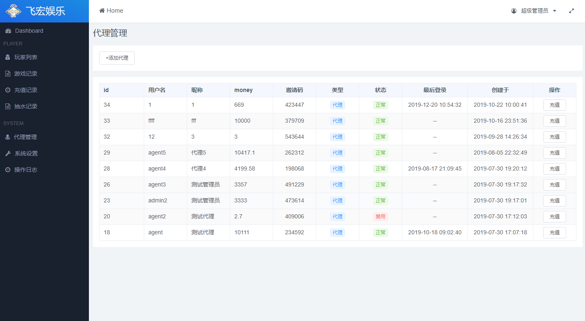

# vue-element-admin-tpl

[Liev Demo](http://vadmin.lanyueos.com)

<div align="center">
  
</div>

Template for admin platform base on `Vue` and `Element-UI`.


## Project Demo

1、**[Project Demo](http://www.lanyueos.com:3003/dist)**

> username: admin, password: 123456



## Project setup
```
yarn install
```

### Compiles and hot-reloads for development
```
yarn run dev
```

### Compiles and minifies for production
```
yarn run build
```

### Run your tests
```
yarn run test
```

### Lints and fixes files
```
yarn run lint
```

### Customize configuration
See [Configuration Reference](https://cli.vuejs.org/config/).
